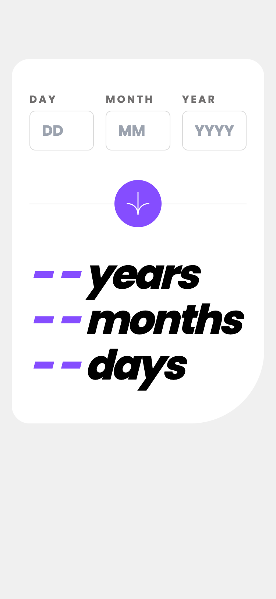
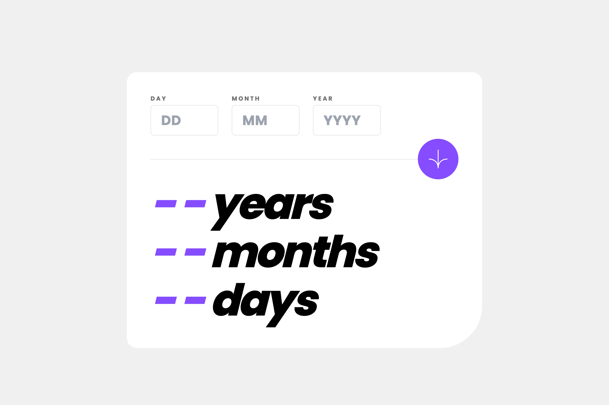

# Frontend Mentor - Age calculator app solution

This is a solution to the [Age calculator app challenge on Frontend Mentor](https://www.frontendmentor.io/challenges/age-calculator-app-dF9DFFpj-Q). Frontend Mentor challenges help you improve your coding skills by building realistic projects. 

## Table of contents

- [Overview](#overview)
  - [The challenge](#the-challenge)
  - [Screenshot](#screenshot)
  - [Links](#links)
- [My process](#my-process)
  - [Built with](#built-with)
  - [What I learned](#what-i-learned)
  - [Continued development](#continued-development)
  - [Useful resources](#useful-resources)
- [Author](#author)
- [Acknowledgments](#acknowledgments)

## Overview

### The challenge

Users should be able to:

- View an age in years, months, and days after submitting a valid date through the form
- Receive validation errors if:
  - Any field is empty when the form is submitted
  - The day number is not between 1-31
  - The month number is not between 1-12
  - The year is in the future
  - The date is invalid e.g. 31/04/1991 (there are 30 days in April)
- View the optimal layout for the interface depending on their device's screen size
- See hover and focus states for all interactive elements on the page
- **Bonus**: See the age numbers animate to their final number when the form is submitted

### Screenshots

### Links

- Solution URL: [https://github.com/Jschles1/age-calculator](https://github.com/Jschles1/age-calculator)
- Live Site URL: [https://age-calculator-tan.vercel.app/](https://age-calculator-tan.vercel.app/)

## My process

### Built with

- Semantic HTML5 markup
- TailwindCSS
- Mobile-first workflow
- [React](https://reactjs.org/) - JS library
- [Next.js](https://nextjs.org/) - React framework
- [Shadcn UI](https://ui.shadcn.com/) - Component library
- [React Hook Form](https://react-hook-form.com/) - Form handling and validation
- [Zod](https://zod.dev/) - Generates typescript schemas for form validation
- [ChatGPT](https://chat.openai.com/) - Provided logic for age calculation

### What I learned

This was the first time I used zod in conjunction with the react-hook-form package for form validation. It provided a good way to create a validation schema using typescript types.

### Continued development

My main goal with this solution was to complete an MVP as fast as possible while maintaining a pixel perfect approach to the provided design. For that reason I skipped the bonus requirement for adding animation to the age calculation numbers. I would like to focus on that more in future challenges.

## Author

- Website - [John Schlesinger](https://john-schlesinger.vercel.app/)
- Frontend Mentor - [@Jschles1](https://www.frontendmentor.io/profile/Jschles1)

## Acknowledgments

- ChatGPT for providing age calculation logic.
